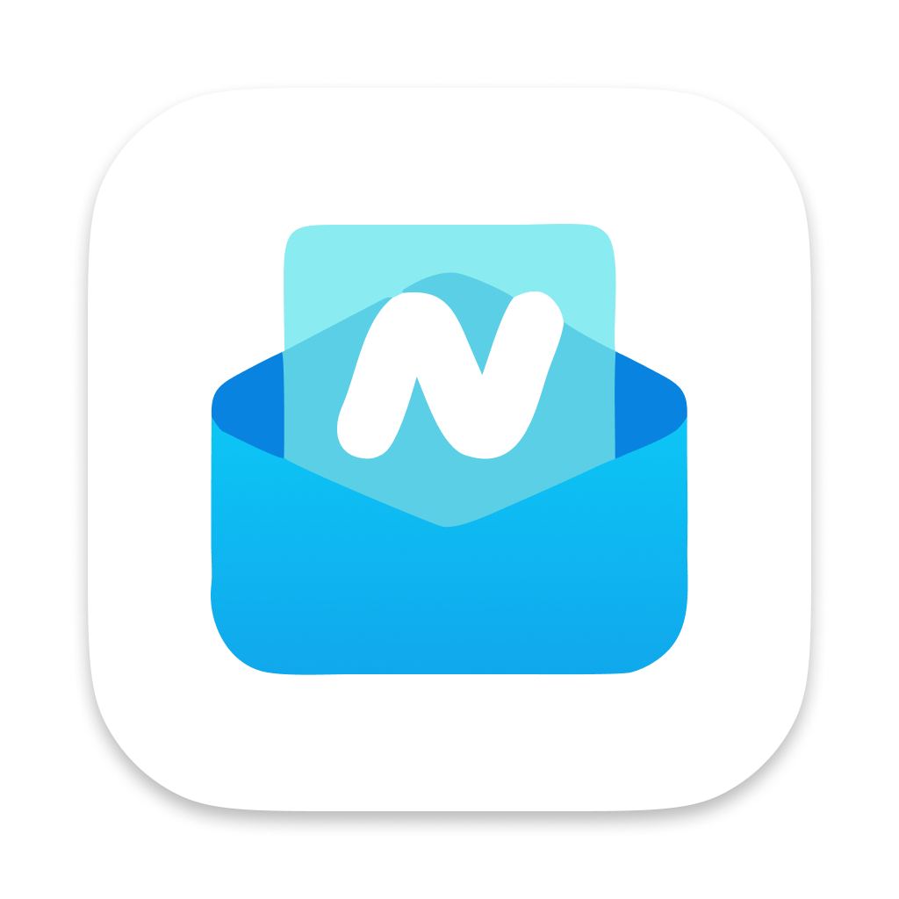
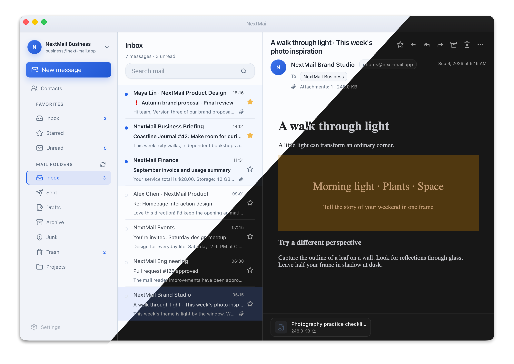

<div align="center">
  
  <h1>NextMail</h1>
  <p><strong>A calm, local-first desktop email client.</strong></p>
  <p>Read mail locally, sync progressively, and download full message content only when you ask for it.</p>

  <p>
    English
    ·
    <a href="./README_ZH.md">简体中文</a>
  </p>

  <p>
    <a href="https://github.com/nextmail-dev/nextmail/releases"></a>
    
    
    
    
  </p>
</div>

> [!IMPORTANT]
> NextMail is currently a preview release. Windows 10 22H2+ and macOS 12+ are the primary supported platforms. Linux builds are available for early testing and have not received the same level of validation.

## Preview



## Why NextMail?

NextMail keeps your mailbox close to you. Mail that is already stored locally opens without waiting for a cloud service, while new mail arrives gradually in the background. Account passwords stay in your operating system's secure credential storage, and your mail data remains in a directory you choose.

It is designed for people who want a desktop mail client that is quick to open, careful with network traffic, and comfortable to use even when the connection is unreliable.

NextMail is built with **Tauri 2**, **React 19**, **TypeScript**, and **Rust**. The desktop shell and local mail services are Rust-powered, with a React interface for the main mail workspace.

## Mail syncing, explained simply

NextMail separates the information needed to show a mailbox from the larger content inside each message.

1. **Syncing a folder prepares a short text preview, without downloading the full message body.** It receives the sender, subject, date, read state, flags, basic attachment information, and a small amount of text so every new list item appears at a stable height.
2. **If you do not open a message, its full body is not downloaded from the server.** Only the short list preview is received automatically, so a large folder does not silently pull every complete message into the device.
3. **If you do not open or save an attachment, its content is not downloaded.** Seeing an attachment listed does not download the file.
4. **Opening a message fetches only the body needed for reading.** Opening or saving an attachment fetches only that attachment. The rest of the mailbox remains untouched.
5. **Large folders appear progressively.** New messages become visible as they arrive, while the app keeps only the part of the list needed for the current view. A folder with thousands of messages does not become thousands of active screen elements.
6. **Full-message syncing is optional.** If you explicitly enable it for an account, NextMail can download message bodies in the background. The default remains on-demand downloading.

This gives you a mailbox that is useful quickly, while avoiding unnecessary downloads, storage use, and background work.

## Highlights

- **Local-first reading** — See existing mail immediately and continue reading when the network is unavailable.
- **Multiple accounts** — Add, switch, edit, re-authenticate, and safely remove accounts.
- **Full writing tools** — Compose rich messages with drafts, templates, signatures, replies, forwards, attachments, and inline images.
- **Offline search** — Search the current account and folder using information already stored locally.
- **Real folder workflows** — Create, rename, move, delete, sort, and mark folders as read from the desktop app.
- **Reliable actions** — Reads, stars, moves, copies, deletes, drafts, and outgoing messages can recover after an interruption.
- **Safe, faithful reading** — Preserve familiar mail layouts and inline images while scripts, forms, unsafe links, and remote content stay constrained.
- **Desktop experience** — Dedicated windows, remembered positions, notifications, themes, bilingual UI, and signed update checks.

## Careful with message content

Email can contain active or misleading content. NextMail sanitizes HTML mail before displaying it, keeps remote images under your control, and checks downloaded attachments before opening or saving them.

## Download

Download available builds from [GitHub Releases](https://github.com/nextmail-dev/nextmail/releases).

| Platform | Status |
| --- | --- |
| Windows 10 22H2+ x64 | Primary validation platform |
| macOS 12+ Intel and Apple Silicon | Supported target; ad-hoc signed and not notarized |
| Linux x64 | Experimental build for early testing |

> [!WARNING]
> Preview builds do not use production Windows code signing or Apple notarization. Your operating system may show an unverified-developer warning. Only download NextMail from this repository.

## Development

Install Node.js, pnpm, Rust stable, and the [Tauri 2 prerequisites](https://v2.tauri.app/start/prerequisites/) for your platform.

```powershell
pnpm install
pnpm tauri dev
```

Run frontend checks from the repository root:

```powershell
pnpm test
pnpm build
```

Run Rust checks from `src-tauri`:

```powershell
cargo fmt --all -- --check
cargo test --offline --locked
cargo clippy --offline --locked --all-targets -- -D warnings
```

For implementation details, engineering conventions, and current limitations, see the [project development guide](./docs/project.md).

## Documentation

- [Changelog](./CHANGELOG.md)
- [Project development guide](./docs/project.md)
- [Iteration records](./docs/iterations/)
- [Architecture decisions](./docs/adr/)
- [Third-party notices](./docs/third-party-notices.md)

## Current limitations

NextMail does not currently provide a unified inbox, conversation aggregation, or cross-account search. Linux remains an experimental platform, and production code signing and notarization are not yet available.

## License

The NextMail Rust package is declared under the MIT license. See [`src-tauri/Cargo.toml`](./src-tauri/Cargo.toml) and the [third-party notices](./docs/third-party-notices.md).
